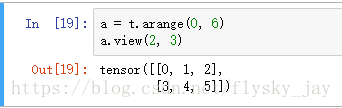
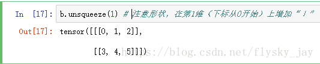
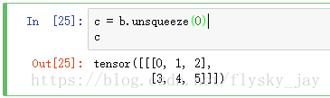
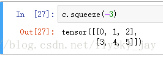
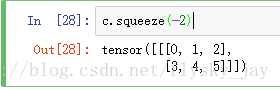

## Pytorch

## .new()

**作用**

创建一个新的Tensor，该Tensor的**type**和**device**都和原有**Tensor**一致，且无内容。

**使用方法**

如果随机定义一个大小的Tensor，则新的Tensor有两种创建方法，如下：

```python
inputs =torch.randn(m, n)
new_inputs =inputs.new()
new_inputs =torch.Tensor.new(inputs)
```

## unsqueeze()

1. 首先初始化一个a



可以看出a的维度为（2，3）

2. 在第二维增加一个维度，使其维度变为（2，1，3）



可以看出a的维度已经变为（2，1，3）了，同样如果需要在倒数第二个维度上增加一个维度，那么使用b.unsqueeze(-2)

二、squeeze()函数介绍

1. 首先得到一个维度为（1，2，3）的tensor（张量）



由图中可以看出c的维度为（1，2，3）

2.下面使用squeeze()函数将第一维去掉



可见，维度已经变为（2，3）

3.另外



可以看出维度并没有变化，仍然为（1，2，3），这是因为只有维度为1时才会去掉。

## expand:   tensor.expand(*sizes)
expand函数用于将张量中单数维的数据扩展到指定的size。

首先解释下什么叫单数维（singleton dimensions），张量在某个维度上的size为1，则称为单数维。比如zeros(2,3,4)不存在单数维，而zeros(2,1,4)在第二个维度（即维度1）上为单数维。expand函数仅仅能作用于这些单数维的维度上。

参数*sizes用于逐个指定各个维度扩展后的大小（也可以理解为拓展的次数），对于不需要或者无法（即非单数维）进行扩展的维度，对应位置可写上原始维度大小或直接写作-1。

expand函数可能导致原始张量的升维，其作用在张量前面的维度上，因此通过expand函数可将张量数据复制多份（可理解为沿着第一个batch的维度上）。

另一个值得注意的点是：expand函数并不会重新分配内存，返回结果仅仅是原始张量上的一个视图。

下面为几个简单的示例：

```
import torch
a = tensor([1, 0, 2])
b = a.expand(2, -1)   # 第一个维度为升维，第二个维度保持原阳

# b为   tensor([[1, 0, 2],  [1, 0, 2]])

a = torch.tensor([[1], [0], [2]])
b = a.expand(-1, 2)   # 保持第一个维度，第二个维度只有一个元素，可扩展

# b为  tensor([[1, 1],

#              [0, 0],

#              [2, 2]])
```

