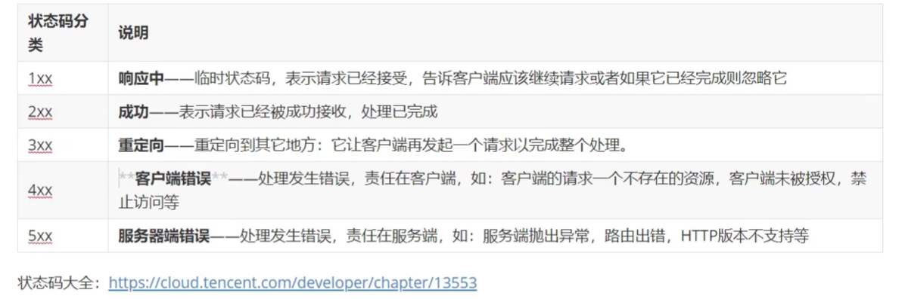

# JavaWeb

## JavaWeb 技术栈

#### B/S 架构 (浏览器服务器架构模式)

* 优点： 易于维护升级

#### 静态资源：HTML、CSS、JS、图片等。负责页面展现

#### 动态资源：Servlet、JSP等。负责逻辑处理

#### 数据库：负责存储数据

#### HTTP协议：负责通信规则

#### Web服务器：负责解析HTTP协议，解析请求数据并发送响应数据

### HTTP：超文本传输协议，规定了浏览器和服务器之间数据传输的规则

#### HTTP协议特点

* HTTP协议特点
  * 基于TCP协议
  * 基于请求响应模型
  * 无状态的协议：对于事务处理没有记忆能力，每次都是独立
    * 缺点：多次请求间不能共享数据。 Java中使用会话(Cookie、Session)解决
    * 优点：速度快

* 请求数据格式

  * 请求行：第一行 GET表示请求方式，/表示请求资源路径，HTTP/1.1表示协议版本
  * 请求头：第二行开始，格式为key：value格式 
  * 请求体：POST请求的最后一部分，存放请求参数

* 响应数据格式

  * 响应行：响应数据的第一行。 HTTP/1.1表示协议版本，200表示响应状态码，Ok表示状态码描述

    

  * 响应头：第二行开始 key: value形式

  * 响应体：最后一部分，存放响应数据

### Servlet

* Servlet 由web服务器创建，Servlet方法由web服务器调用
* 生命周期
  * 加载和实例化：默认情况下 Servlet第一次被访问时，由容器创建Servlet对象
    * @WebServlet(urlPatterns="/demo",loadOnStartup=1)
      * 负整数：第一次被访问时创建Servlet对象
      * 0或正整数：服务器启动时创建，数字越小优先级越高
  * 初始化：init() 方法初始化这个对象，完成一些加载配置文件创建连接等初始化工作，只会调用一次
  * 请求处理：service() 每次请求Servlet时，就会调用service()方法对请求进行处理
  * 服务终止：需要释放内存或者容器关闭时，destroy()方法进行资源释放

​	