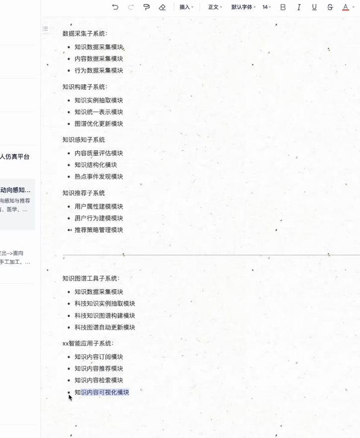

# LeetCode 笔记

变长数组可以在 O(1) 的时间内完成获取随机元素操作，哈希表可以在 O(1)的时间内完成插入和删除操作

## 位运算相关

n & (n−1)，其预算结果恰为把 n的二进制位中的最低位的 1 变为 0 之后的结果。

如： 6 & (6−1)=4,6=(110)  ,4=(100) ，运算结果 4 即为把 6 的二进制位中的最低位的 1 变为 0 之后的结果。

这样我们可以利用这个位运算的性质加速我们的检查过程，在实际代码中，我们不断让当前的 n 与 n−1 做与运算，直到 n 变为 0 即可。因为每次运算会使得 n 的最低位的 1 被翻转，因此运算次数就等于 n 的二进制位中 1 的个数。

知识内容可视化模块

功能定义

  设计方案
