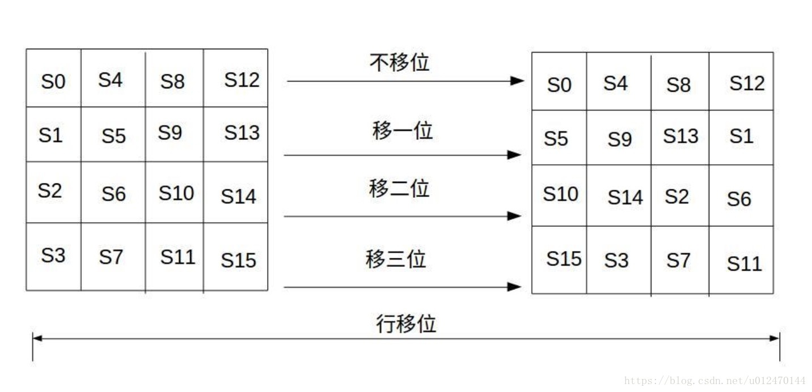
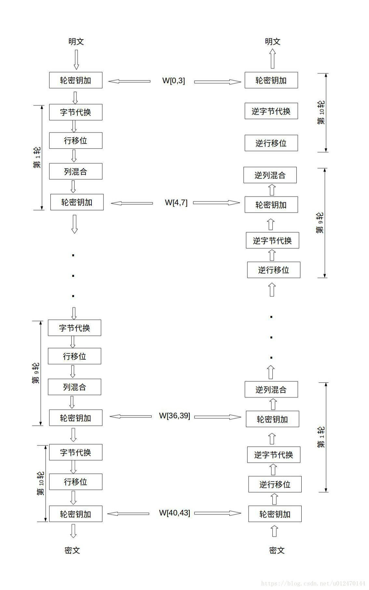
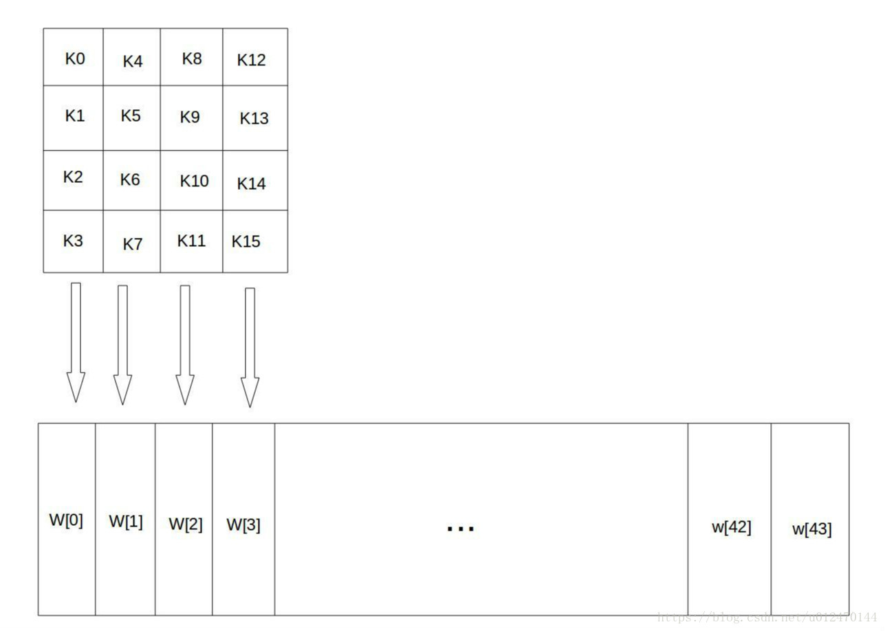
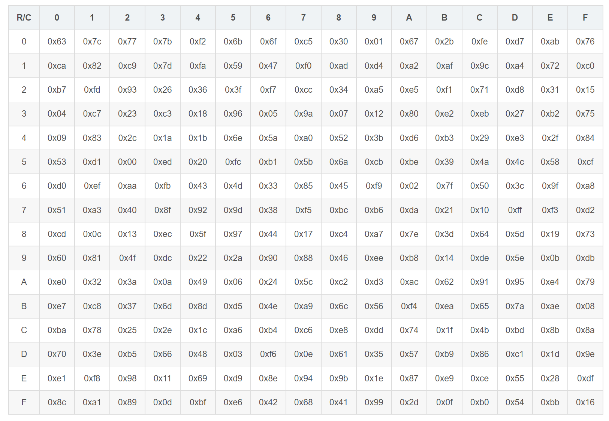
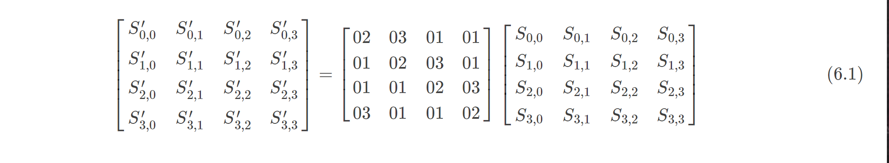
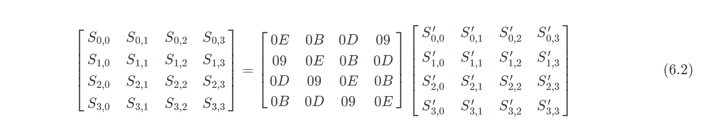

# 对称加密之AES加密算法

## 一. AES加密算法介绍（Advanced Encryption Standard）

### 1.1 背景：

上一篇介绍DES算法时已经说到，尽管DES算法本身并无设计缺陷，但由于计算硬件的飞速发展，DES的56位密钥空间已经无法经受住高速密钥穷举攻击。为扩展密钥空间，168位密钥空间的三重DES后来被广泛应用，但三次DES串行加密也有明显的弊端，那就是加解密效率的降低。

1997年，ANSI开始向全世界公开征集高级加密标准（AES），经过多轮筛选和算法分析，2000年比利时密码学家Joan Daemen和Vincent Rijmen所设计Rijndael算法被选为AES，并于2006年成为有效标准。2006年，作为三重DES的替代者，AES已经是全球范围内最流行的对称分组加密算法之一。

### 1.2 算法说明：

作为DES的替代算法，AES在设计上满足以下标准：

和DES一样，能有效抵御所有已知攻击；
加密算法易于现有软硬件平台的实现，且加解密过程效率优于DES；
具有典型的对称分组加密算法特性，以快速混淆和扩散为设计原则，本质是轮函数过程的循环。
AES的数据分组长度统一为128位，而密钥空间可根据需要采用128位、192位和256位三种不同长度。和大多数分组加密算法不一样AES的轮函数并没有采用Feistel结构设计，而是使用了3个不同的可逆均匀变换。

### 1.3 AES算法主要步骤包括：

密钥扩展（Key Expansion），使用密钥扩展算法将128位用户主密钥扩展成R个轮密钥；
初始轮（Init Round），即为轮密钥加；
重复轮（Rounds），每一轮包括：字节替换（SubBytes），行移位（Shift Rows），列混合（Mix Columns），轮密钥加（Add Round Key）四个步骤；
最终轮（Final Round），最终轮比重复轮少了列混合的步骤。

## 二. AES结构

AES标准包括AES-128、AES-192和AES-256，表1.1 所示是各标准规范的密钥空间、加密轮数和分组长度，本文以下内容将以AES-128为例进行讲解。

标准	密钥长度	轮数	分组长度
AES-128	128位(16字节）	10	128位（16字节）
AES-192	192位(24字节）	12	128位（16字节）
AES-256	256位(32字节）	14	128位（16字节）
			表 1.1 AES各标准
AES以字节（8 bits）作为处理单位，16字节的明文分组可以用P=[P0,P1,…,P15]的4*4字节矩阵表示，在加密过程的每一轮中，该矩阵内容不断发生变化，称为状态矩阵S=[S0,S1,…,S15]，经过10轮处理之后，最终得到密文矩阵C=[C0,C1,…,C15]，过程如图1.2所示。
				图 1.2 明文矩阵状态转换图

如1.3节所述，在密钥扩展获得了11个轮密钥之后，明文将经过1轮初始轮密钥加处理，9轮重复轮函数处理，以及1轮最终轮处理，实际上经过11轮处理（其中初始轮没有进行可逆变换，仅有轮密钥加操作）。图2.1展示了加密过程中每一轮需要经过的字节替换、行移位、列混合和轮密钥加的四个步骤，这四个步骤使得每轮输入的每一位充分地混淆并将影响尽快扩散到输出的每一位中，是AES算法的核心。
			   图 2.1 AES分组处理流程图

图2.1也展示了解密的过程，同样经历的是10+1轮（初始轮也是仅做轮密钥加），上文已经说过，四个轮操作都是可逆变换，因此解密的四个轮步骤就是对应轮加密的四个步骤的逆执行。

以下各节将依次详细介绍密钥扩展、字节替换、行移位、列混合等步骤。

## 三. 密钥扩展

与明文分组矩阵一样，密钥扩展也是以8比特字节作为单位对主密钥进行处理，128位主密钥可以表示为K=[K0,K1,…,K15]的4*4字节矩阵。经过密钥扩展函数，K扩展为44列的轮密钥字矩阵（其中一个字为4字节32位），表示为W=[W0,W1,…W43]。每一轮依次取出前4个字（128位）作为本轮轮密钥，如初始轮轮密钥为W[0,3]=[W0,W1,W2,W3]。密钥扩展的过程如图3.1所示。
						图 3.1 密钥扩展

## 四. 字节替换

AES的字节替换，本质上和DES的S盒替换是一样的，都是根据输入字节查表来获得对应的输出字节，不同的是，AES的S盒规格是16*16的字节矩阵。因此，字节替换步骤也是AES算法轮函数的关键，相较于其他运算步骤的线性特征而易于分析，S盒的非线性提供了更好的安全性。
字节替换的规则是，将状态矩阵中的每个字节的高4位作为行值，低4位作为列值，取出S盒中对应的矩阵字节元素作为替换字节。例如状态矩阵中某个输入字节值为0x6b（01101011），那么行值为6（0110），列值为b（1011），查询如表4.1所示S盒，得到的输出字节为0x7f(01111111)。

​												表 4.1 AES S-box 示例

经过该步骤的字节替换之后，输入的4*4字节状态矩阵中的每个字节元素都被新字节替代，得到的新状态矩阵将作为下一步行移位的输入。

## 五. 行移位

行移位步骤对输入的状态矩阵进行简单的行循环移位操作（不同行的移位数不同，具体移位数由算法输入决定），本文以第几行左移几个字节为例，行移位过程如图5.1所示，移位完成之后得到的新状态矩阵将作为下一步列混合的输入。

											图 5.1 AES行移位示例

## 六. 列混合

### 6.1 列混合加密过程

​    列混合基于矩阵乘法实现，使得状态矩阵中的每一列的各个元素之间按照预先定义的列混合加密矩阵的权重来产生相互混淆的影响，产生列元素互相之间被混合的新状态矩阵。
例如，根据公式6.1进行列混合加密，第0行第0列元素的输出计算表示为：
​							S′_0,0=(02∗S0,0)⊕(03∗S1,0)⊕(01∗S2,0)⊕(01∗S3,0)

该元素将第0列所有元素按预设权重混合起来。
**[注意]**：该公式中的乘法和加法不是普通数学意义的乘和加，而是有限域GF(2^8)四则运算中的乘和加，加法即是按位异或，乘法较为复杂，此处不做赘述，有兴趣的同学可以进一步了解有限域的相关知识。

6.2 列混合解密过程（乘法逆元)
    上文说过，AES轮函数中的所有四个步骤都是可逆变换，那么列混合的乘法逆元是如何得到的呢？列混合的逆运算涉及到有限域和线性代数的相关知识，具体如何计算的过程不在本文中给出，此处仅给出公式6.1中列混合加密的解密逆运算，如公式6.2所示。
**可以证明的是，列混合加密矩阵和其逆元做矩阵乘法，其结果就是单位矩阵**。经过列混合加密输出的状态矩阵，将作为轮函数的最后一个步骤——轮密钥加的输入。

## 七. 轮密钥加

轮密钥加的过程十分简单，就是将列混合输出的状态矩阵（共128位）和密钥扩展得到的本轮轮密钥（共128位）进行按位异或，得到最终的本轮状态矩阵输出。

​														     S′=S⊕W_r

## 八. 总结

​    AES总体设计上来说是典型的对称分组算法模式，比如对明文采取固定大小的分组数据块进行处理、采用密钥扩展获得每轮的轮密钥并对明文分组进行多轮重复处理等。而与以DES为代表的对称分组算法不同的是，AES并没有采用经典的Feistel结构作为轮函数结构，原因在于Feistel结构中每轮操作的最后一步都要将输出的分组左右半部分进行交换，这导致了不能快速并行处理的缺陷，而在当前密钥空间和明文分组长度越来越大的要求下，加密算法的速率问题正变得和安全性同等重要。AES算法中耗时的部分几乎都可以所有字节同时并行处理，这大大加快了加解密的过程，因此也使得AES正快速取代三重DES的位置，成为最流行的对称分组加密算法。
​    当然，作为后起之秀，AES的安全性仍需要经过大量算法分析和破译的检验，来证明其算法本身没有致命缺陷，在这点上来说，DES仍然是不可取代的。
