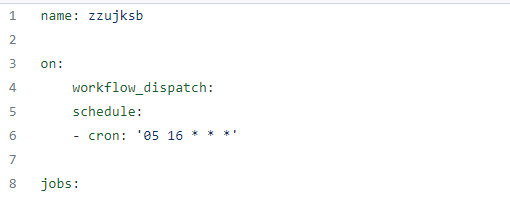

justsoso  

myvs0.txt 

myvs_1=否&myvs_2=否&myvs_3=否&myvs_4=否&myvs_5=否&myvs_6=否&myvs_7=否&myvs_8=否&myvs_9=否&myvs_10=否&myvs_11=否&myvs_12=否&myvs_13=g&myvs_13a=41&Btn3=获取地市&myvs_13b=4153&myvs_13c=河南省郑州市郑州大学北校区&myvs_24=否&myvs_26=5&memo22=成功获取&did=2&men6=a&fun18=520

myvs1.txt

myvs_1=否&myvs_2=否&myvs_3=否&myvs_4=否&myvs_5=否&myvs_6=否&myvs_7=否&myvs_8=否&myvs_9=否&myvs_10=否&myvs_11=否&myvs_12=否&myvs_13=g&myvs_13a=41&Btn3=获取地市&myvs_13b=4101&myvs_13c=河南省郑州市农科院&myvs_24=否&myvs_26=5&memo22=成功获取&did=2&men6=a&fun18=520

2) #!/bin/bash
    uid=$1
  upw=$2
  uidarr=(${uid//,/ }) #字符串预处理
  upwarr=(${upw//,/ })
  num=${#uidarr[@]}
  smbtn="进入健康状况上报平台"
  url1="https://jksb.v.zzu.edu.cn/vls6sss/zzujksb.dll/login"
  url2="https://jksb.v.zzu.edu.cn/vls6sss/zzujksb.dll/jksb"
  for((i=0;i<num;i++))
  do
  case $i in
    0) #第一个学号
      curl -d "uid=${uidarr[i]}&upw=${upwarr[i]}&smbtn=$smbtn&hh28=907" -s $url1 -o temp.txt
      udata=$(sed -n '11p' temp.txt)
        udata=${udata#*ptopid=}
        udata=${udata%\"\}\}*}
        ptopid="${udata%&*}"
        sid="${udata#*&sid=}" #登录获取ptopid和sid
        curl -d "day6=b&did=1&men6=a" -d "ptopid=$ptopid&sid=$sid" -s $url2 -o /dev/null #进入确认界面
        curl -d "@myvs0.txt" -d "jingdu=113.663100&weidu=34.781471&ptopid=$ptopid&sid=$sid" -s $url2 -o temp.txt #打卡
        udata=$(sed -n '24,26p' temp.txt)
        echo "$udata" >> result.html
        ;;
    1) #第二个学号
        curl -d "uid=${uidarr[i]}&upw=${upwarr[i]}&smbtn=$smbtn&hh28=907" -s $url1 -o temp.txt
        udata=$(sed -n '11p' temp.txt)
        udata=${udata#*ptopid=}
        udata=${udata%\"\}\}*}
        ptopid="${udata%&*}"
        sid="${udata#*&sid=}" #登录获取ptopid和sid
        curl -d "day6=b&did=1&men6=a" -d "ptopid=$ptopid&sid=$sid" -s $url2 -o /dev/null #进入确认界面
        curl -d "@myvs1.txt" -d "jingdu=113.679&weidu=34.788&ptopid=$ptopid&sid=$sid" -s $url2 -o temp.txt #打卡
        udata=$(sed -n '24,26p' temp.txt)
        echo "$udata" >> result.html
        ;;
        *)
        echo "You didn't have any parameter"
        ;;
        esac
        done

