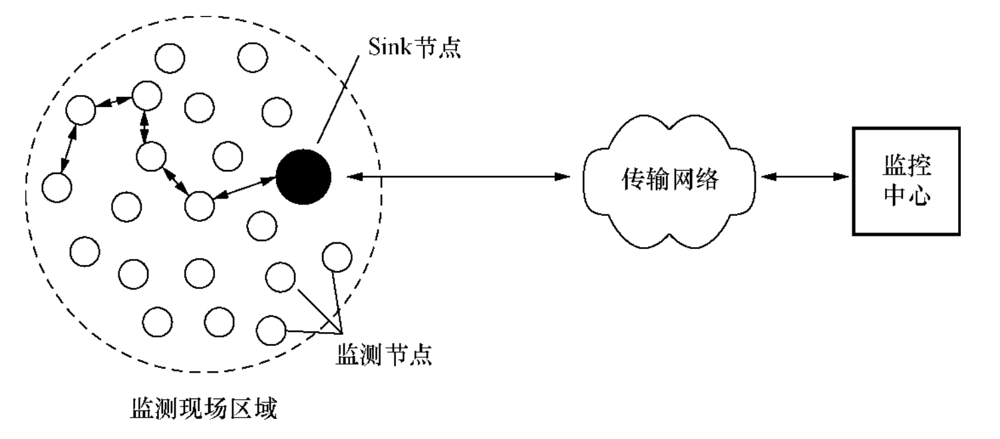
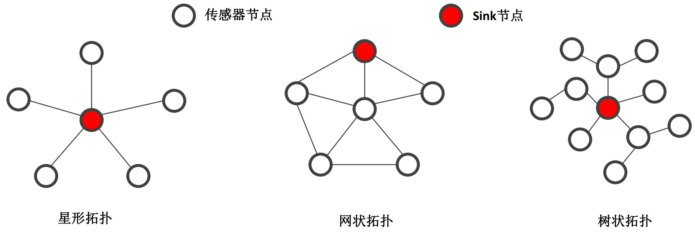
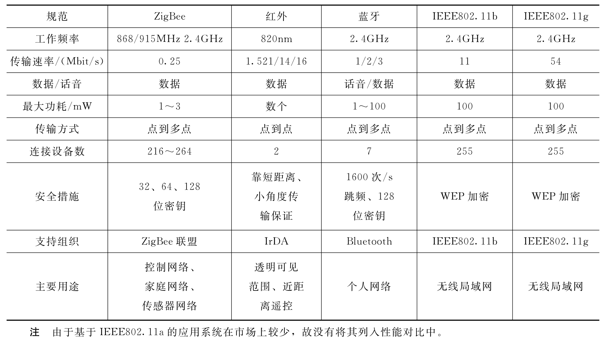
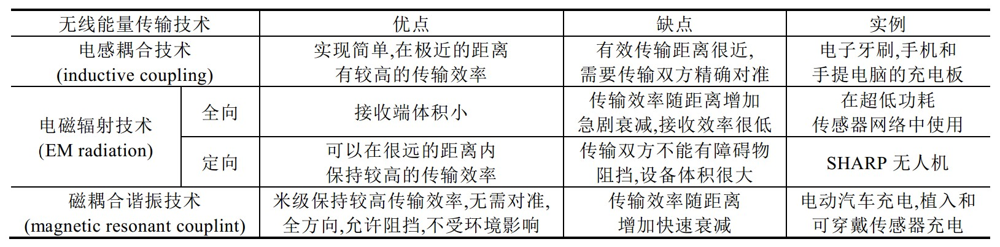

# 无线传感器网络

### 无线传感器网络的组成

多个功能节点之间通过无线通信形成一个连接的网络，这个网络我们称为无线传感器网络。

无线传感器网络中主要包含两类节点：

1. 传感器节点：具有感知和通信功能的节点，在传感器网络中负责监控目标区域并获取数据，以及完成与其他传感器节点的通信，能够对数据进行简单的处理。
2. Sink节点：又称为基站节点，负责汇总由传感器节点发送过来的数据，并作进一步数据融合以及其他操作，最终把处理好的数据上传至互联网。

|   特点   | 传感器节点 |      sink节点      |
| :------: | :--------: | :----------------: |
| 计算能力 |  非常有限  |       能力强       |
| 存储空间 |  非常有限  |        充足        |
|  安全性  |     低     |         高         |
|   电量   |  非常有限  |        充足        |
|   成本   |    低廉    |        昂贵        |
|   部署   | 大范围部署 | 部署数目受成本限制 |

### 无线传感器网络的拓扑结构

三种常见拓扑结构

1. 星型拓扑：具有组网简单、成本低；但网络覆盖范围小，一旦sink节点发生故障，所有与sink节点连接的传感器节点与网络中心的通信都将中断。星形拓扑结构组网时，电池的使用寿命较长。
2. 网状拓扑：具有组网可靠性高、覆盖范围大的优点，但电池使用寿命短、管理复杂。
3. 树状拓扑：具有星形和网状拓扑的一些特点，既保证了网络覆盖范围大，同时又不至于电池使用寿命过短，更加灵活、高效。

## 无线传感器网络的应用领域

无线传感器在生产和生活中处处可见，总结起来主要在以下八大领域应用广泛[3]：

**1、军事领域的应用**

在军事领域，由于WSN具有密集型、随机分布的特点，使其非常适合应用于恶劣的战场环境。利用WSN能够实现监测敌军区域内的兵力和装备、实时监视战场状况、定位目标、监测核攻击或者生物化学攻击等。

**2、辅助农业生产**

WSN特别适用于以下方面的生产和科学研究。例如，大棚种植室内及土壤的温度、湿度、光照监测、珍贵经济作物生长规律分析、葡萄优质育种和生产等，可为农村发展与农民增收带来极大的帮助。采用WSN建设农业环境自动监测系统，用一套网络设备完成风、光、水、电、热和农药等的数据采集和环境控制，可有效提高农业集约化生产程度，提高农业生产种植的科学性。

**3、在生态环境监测和预报中的应用**

在环境监测和预报方面，无线传感器网络可用于监视农作物灌溉情况、土壤空气情况、家畜和家禽的环境和迁移状况、无线土壤生态学、大面积的地表监测等，可用于行星探测、气象和地理研究、洪水监测等。基于无线传感器网络，可以通过数种传感器来监测降雨量、河水水位和土壤水分，并依此预测山洪爆发描述生态多样性，从而进行动物栖息地生态监测。还可以通过跟踪鸟类、小型动物和昆虫进行种群复杂度的研究等。

**4、基础设施状态监测系统**

WSN技术对于大型工程的安全施工以及建筑物安全状况的监测有积极的帮助作用。通过布置传感器节点，可以及时准确地观察大楼、桥梁和其他建筑物的状况，及时发现险情，及时进行维修，避免造成严重后果。

**5、工业领域的应用**

在工业安全方面，传感器网络技术可用于危险的工作环境，例如在煤矿、石油钻井、核电厂和组装线布置传感器节点，可以随时监测工作环境的安全状况，为工作人员的安全提供保证。另外，传感器节点还可以代替部分工作人员到危险的环境中执行任务，不仅降低了危险程度，还提高了对险情的反应精度和速度。

**6、在智能交通中保障安全畅通**

智能交通系统主要包括交通信息的采集、交通信息的传输、交通控制和诱导等几个方面。无线传感器网络可以为智能交通系统的信息采集和传输提供一种有效手段，用来监测道路各个方向的车流量、车速等信息。并运用计算方法计算出最佳方案，同时输出控制信号给执行子系统，以引导和控制车辆的通行，从而达到预设的目标。

**7、在医疗系统和健康护理中的应用**

无线传感网技术通过连续监测提供丰富的背景资料并做预警响应，不仅有望解决这一问题还可大大提高医疗的质量和效率。无线传感网集合了微电子技术、嵌入式计算技术、现代网络及无线通信和分布式信息处理等技术，能够通过各类集成化的微型传感器协同完成对各种环境或监测对象的信息的实时监测、感知和采集。

**8、在智能家居中应用**

在家电中嵌入传感器结点，通过无线网络与互联网连接在一起，利用远程监控系统可实现对家电的远程遥控，无线传感器网络使住户可以在任何可以上网的地方通过浏览器监控家中的水表、电表、煤气表、电器热水器、空调、电饭煲等，安防系统煤气泄露报警系统、外人侵入预警系统等。

### 无线传感器网络基本特点

无线传感器网络具有以下特点

1. 自组织方式组网：组网不依赖任何固定的网络设施，传感器节点通过分布式网络协议形成自组织网络，能够自动调整来适应节点的移动、加入和退出。因为传感器的维护成本很高，所以需要具备自我管理能力 (self-managed, including self-organizing, self-healing, self-optimizing, self-protecting, self-sustaining, self-diagnostic) 。
2. 无中心结构：网络中所有传感器节点地位对等，并构成一个对等式网络。节点可以随时加入和离开网络，网络中部分节点发生故障不影响整个网络的运行。
3. 网络有动态拓扑：无线传感器网络中的节点可能由于电池能量耗尽或者故障而从网络中退出，也可能是按照某种设定的程序从网络中退出（比如说休眠）；网络外的节点可随时加入网络中。
4. 采用多跳路由通信：覆盖同样大小的区域单跳路由消耗的能量远远超过了多跳路由，所以绝大部分传感器网络采用多跳路由，不过多跳路由也会导致数据传输出现延迟、复杂的路由计算等新问题产生。
5. 高冗余：由于传感器节点容易出现故障，为了使受损的传感器节点周围的其他传感器节点能够代替受损的节点继续工作，所以传感器网络的节点一般比较密集，具有高冗余的特点。
6. 硬件资源及功能有限：无线传感器节点由于受价格、体积和携载能源的限制，其计算能力、数据处理能力、存储空间有限，决定了在节点操作系统的设计中，协议层次内容不能过于复杂。
7. 电源续航能力较小：网络节点有电池供电，电池续航能力小，在许多应用场景中无法更换电池。传感器节点电能用完，该节点就失去了作用，所以在设计传感器网络时需要考虑节能。

### 无线传感器网络设计的目标

**目标一：提高性能**

对传感器网络来说什么是性能？有很多指标可以用来评估传感器网络的性能情况，其中主要有：

1. Energy efficiency/system lifetime（能源效率/系统生命周期）：传感器是电池驱动的，因此能源是一种非常稀缺的资源，为了延长网络的寿命，必须明智地管理能源[1]。
2. Latency（延迟）：许多传感器应用程序需要低延迟才能保证服务，所以协议必须确保感知到的数据将在一定的延迟内交付给用户。
3. Fault tolerance（容错）：传感器和链路故障的鲁棒性必须要通过冗余和协同处理以及通信来实现。
4. Scalability（可扩展性）：由于传感器网络可能包含数千个节点，因此可伸缩性是一个关键因素，它保证了网络性能不会随着网络大小(或节点密度)的增加而显著下降。
5. Transport capacity/throughput（通信能力/吞吐量）：由于大多数传感器数据必须传送到单个基站或融合中心，因此传感器网络中存在一个关键区域（或者节点），这些区域必须中继网络中几乎所有节点生成的数据。因此，即使在平均通信率较低的情况下，这些关键节点上的通信量也很大。显然，这一领域对系统生命周期、数据包的端到端延迟和可伸缩性有至关重要的影响。

**目标二：节约能源**

哪些设计和措施可以节约能源？

1. 进行数据压缩，以减少要传输的数据包数量：因为对传感器网络来说，绝大部分能量消耗在无线通信模块，数据包传输前进行压缩可以大大减少通信过程中的能量消耗。
2. 去除中心化，利用分布式处理数据的方法：因为传感器上传给中心节点的数据存在大量冗余信息，如果将所有的计算都集中在中心节点，将给中心节点带来较大负荷以及不必要的能源浪费，可以考虑将一部分计算任务分配给传感器节点。
3. 引入传感器睡眠机制减少电量消耗：为了防止传感器节点在接收意外数据包时浪费能量，可以考虑睡眠机制。例如，通过协调策略来决定哪些节点应该进入休眠状态。
4. 路由策略：最简单的节能路由协议是最少能量路由，即寻找一条能耗最低的路由，通过它传送数据。但这样未必能延长网络的生存时间，因为某些处于关键位置的节点可能被过度使用而导致电源过早耗尽。最大最小路由更多的考虑了电池的剩余电量，而最少能量路由考虑的是某次通信需要消耗的电量，一个很自然的改进思路是可以将两种方法结合起来，定义一个电源开销函数，综合考虑两种策略。
5. 拓扑管理：无线传感器网络部署中，节点密度都比较高，因为提高节点密度可以提高结果的精确度，但如果系统生存时间更重要的话，就可以对网络拓扑进行管理。如果硬件支持可变发射功率的话，采用低的发射功率也能够降低网络电源开销，同时缓解共享空间信道的竞争，提高网络容量。

**目标三：保证安全**

导致无线传感器网络不安全的原因[2]：

1. 资源非常有限：有限的内存和存储空间、能量有限、计算能力有限等，这些局限性使得一些较成熟的安全方法无法在传感器网络上实行。
2. 不可靠的通信：信道的暴露使得数据包在传输过程不可靠，而且传输过程容易发生数据包冲突、延迟等问题。
3. 无人管理：传感器网络在野外无人区域容易遭受物理攻击，此外通过远程管理方式无法检测到物理篡改等。

无线传感器网络安全的要求：

1. 数据机密性：传感器节点不能向邻居节点泄露敏感参数；通信的信道必须保证安全可靠；加密的算法要安全可靠。
2. 数据完整性：因为在通信过程中，篡改数据包会导致恶劣的通信环境，所以需要保证数据包在发送过程中难以被篡改。
3. 数据的新鲜性：数据包要保证是最新的，防止旧消息被重播。
4. 可用性：一些传统的安全算法需要在修改后才能应用在无线传感器网络，其中一些算法在应用时也会带来更多的开销等问题，导致这些算法在实际中不实用。
5. 身份认证：因为攻击者不仅能篡改数据包还可能注入附加数据包，所以需要确保数据的来源正确，需要对数据的来源进行验证。

## 无线传感器网络中的关键技术

无线传感器网络中主要应用到以下关键技术[4]：

**一、网络自组织连接技术**

也称为拓扑控制技术，传感器网络的自组织组网和连接是指在满足区域覆盖度和连通度的条件下，通过节点发送功率的控制和网络关键节点的选择，构建邻居链路，形成一个高效的网络连接拓扑结构，以提高整个网络的工作效率，延长网络的生命周期。自组织控制分为**节点功率控制**和**层次拓扑控制**两个方面。

1. 节点功率控制：在满足网络连通度的条件下，尽可能减少发射功率。相关研究成果有：基于节点度数进行功率控制（提出了LMA算法）、基于邻近图进行功率控制（提出了DRNG、DLMST算法）；
2. 层次拓扑控制：采用分簇机制实现，在网络中选择少数关键节点作为簇首，由簇首节点实现全网的数据转发，簇成员节点可以暂时关闭通信模块，进入睡眠状态。相关研究成果有：提出了LEACH、TopDisc、GAF算法。

> 当前国内外对无线传感器网络的拓扑控制取得了很多成果，许多新的算法被提出，其中一些拓扑控制算法不仅仅在理论体系较为完备，并且在实际工程中得到了应用。还有一些拓扑控制算法通过计算机仿真，效果良好，但是大部分算法还处于理论研究阶段。在研究特点上，出现了同时使用多种方式、多种算法的结合形成传感器网络的拓扑控制机制。拓扑控制还面临着一些重要的关键性问题，如对于大规模的无线传感器网络，拓扑控制算法如果没有较快收敛速度，工程上的实用性就会不强；面对动态拓扑结构如何自适应控制等。

**二、网络覆盖控制技术**

为了保证无线传感器网络监测的有效性，通常要求监测范围内的每一点都至少处于一个无线传感器节点的监测范围以内；为使无线传感器能够完成对给定区域进行特定的监测任务，必须要进行覆盖控制。目前国内外学者研究的覆盖问题主要包括分为以下几类[5]：

1. 区域/空间覆盖：所有传感器的监测范围需要覆盖整个监测区域。研究者将原问题转化为SET K-COVER问题，提出了MCCH、PEAS算法；
2. 点覆盖：所有传感器的监测范围需要覆盖整个监测区域内一些指定监测点。点覆盖问题比空间覆盖问题简单，当监测节点密度很大时，可以近似认为整个区域需要被覆盖，从而转化为区域覆盖问题。
3. 栅栏覆盖：覆盖区域为带状，应用场景是：当入侵者从部署区域穿过时能够被传感器检测到，如非法偷渡人员的检测。
4. 信息覆盖：不考虑物理区域的覆盖，而是直接关注区域中信息的捕获情况。这种覆盖定义通常使用一个概率感知模型或者其他更复杂的感知模型（如基于信息融合理论的感知模型）。当区域中任何一点上的信息能以高概率（大于某个阈值）被无线传感器网络所捕获时，那么整个区域是信息覆盖的。

> 覆盖问题关注传感器对监测区域信息的感知质量，它是无线传感器网络设计的首要问题，也是无线传感器网络中最基本、最重要问题之一，并且一直是热点问题。

**三、网络无线通信技术**

因为传感器节点传输信息时，比执行计算时更消耗能量，传输1比特信息100m距离需要的能量相当于执行3000条计算指令消耗的能量，所以需要对无线通信模块进行控制；另外，无线通信信息在发送过程中容易受到外界干扰，所以无线传感器网络需要抗干扰的通信技术。目前有以下无线通信技术：

1. 蓝牙技术：蓝牙技术是一种短距离微功耗的无线通信技术，具有较强的抗干扰能力，成本低而且在各种设备中都可以使用，不过存在通信距离较短的缺点（一般为10m左右）。
2. Wi-Fi技术：也称为无线局域网通信技术，具有可移动性强，安装灵活、便于维护、能快速方便地实现网络连通等优点，常见的如IEEE802.11a、IEEE802.11b、IEEE802.11g。
3. 超宽频技术：简称UWB，超宽频技术最初主要应用于高精度雷达和隐秘通信领域，UWB技术是一种在宽频带基础上，通过脉冲信号高速传输数据的无线通信技术，具有发射距离短、发射功率低、成本低等特点。
4. 近短距无线传输：代表有NFC技术。
5. ZigBee技术：ZigBee主要应用于短距离范围、数据传输率不高的各种电子设备，传输速率低、成本比较低等特点，适合一些简单的网络，ZigBee比一些常见无线通信技术更加安全可靠。

几种短距离无线通信技术的比较

**四、定位技术**

网络中节点定位是无线传感器网络应用的基础，传感器节点须明确自身位置才能为用户提供有用的信息，实现对目标的定位和追踪。另一方面，了解传感器节点的位置信息还能提高路由效率、报告网络的覆盖质量，实现网络的负载均衡等。在一些应用场合中，传感器节点被随机地撒布在特定的区域，事前无法知晓这些传感器的位置，部署完成后需要通过一些定位技术来准确地获取其位置信息。现有的研究工作主要是根据以下三种物理参数来实现网络的定位[6]：

1. Received signal strength (RSS)：基于接收信号强度的计算方法，电磁波的功率与传输功率成正比，与到源距离的平方成反比。根据这一物理定律，通过不同路径到达接收设备的信号强度是估计距离和位置的基础。
2. Time of flight (TOF)：基于飞行时间的计算方法，发射器和接收器之间的距离等于发射信号的飞行时间或电磁传播时间乘以传播速度，即光速。当传输时间已知时，距离可以通过测量接收器处的信号到达时间（TOA）来确定，或者根据不同位置的接收时间差异来确定距离。
3. Angle of arrival (AOA)：基于入射角的计算方法，根据电磁波的到达角（AOA）或到达方向（DOA）来确定传感器的位置。

此外，还可以利用GPS系统来实现传感器节点的高精度定位，不过这种方法成本较高。

**五、网络安全技术**

前面已经介绍无线传感器网络中的安全隐患主要来源于三个方面： 资源非常有限、不可靠的通信以及无人管理。这些特点使得传感器网络容易遭受各种攻击，按照**攻击的方式**可以划分为：

1. **`拥塞攻击`**（Congestion attack）：无线通信环境是一个开放环境，如果该环境中的两个设备节点发送的信号使用同样或相近的频率，则彼此间会产生强烈的干扰，导致都不能正常通信。当攻击者使用一定的设备在无线传感器网络工作的频段上不断发送干扰信号，则在干扰设备的通信覆盖范围内的无线传感器网络节点都不能正常工作。如果攻击范围足够大还可能导致整个无线传感器网络瘫痪。
   **防御策略**：使用宽频和跳频通信，被攻击的节点在检测到所在空间遭受攻击以后，网络节点将通过统一的策略跳转到另一个频率进行通信。
2. **`碰撞攻击`**（Collision Attack）：恶意节点可以像传感器网络的合法节点一样参与发送数据，恶意节点发送的数据包如果和合法节点发送的数据包中有一个字节的数据在传输过程中发生了冲突，那么整个数据包就会被丢弃。
   **防御策略**：针对碰撞攻击可以使用纠错码，可以更正冲突引起的数据包的错位。使用信道监听机制，节点在发送数据前，首先对信道进行一个随机监听，在预测信道空闲的时间区段发送数据，可以降低冲突发生的概率。
3. **`能量耗尽攻击`**（Energy exhaustion attack）：利用一些链路层协议中有错包重传机制，恶意节点通过不断制造冲突，导致节点不断重复发送上一数据包，最终耗尽传感器节点的能量。
   **防御策略**：对一个节点重传信息次数设置一个门限值，如果重传次数超过门限值，节点将判定自己受到攻击并自动转换到休眠模式。
4. **`女巫攻击`**（Sybil attack）：无线传感器中，女巫攻击者可以捏造出很多身份对网络进行攻击。很多无线传感器网络MAC协议通过投票方式从一系列可能的通信链路中选择最佳的传输链路，女巫攻击者可以利用伪造的身份来填满投票箱，来误导投票结果。
   **防御策略**：无线电资源测试是对抗女巫攻击的一个有效方法。节点为它的每一个邻居节点分配一个信道广播测试信息，节点通过对信道的监听找出非法节点。另一个防御Sybil攻击的技巧是使用随机密钥预先分配技术，限定有限数量密钥的密匙环，因为一个节点随机生成的身份不会拥有足够的钥匙来分配，因此无法在网络上通信时进行加密或解密消息。
5. **`丢弃或贪婪破坏攻击`**：通过一定的技术手段将一个或多个恶意节点伪装成正常节点，网络会错误地将它们当作正常的路由节点来使用。恶意节点在冒充正常节点转发数据时，会随即丢弃一些有用数据包或者将自己伪造的数据包以较高优先级发送，大大增加了网络数据收发的出错率。
   **防御策略**：使用多径路由，即使被恶意节点丢弃的数据包也可以采用其他路径到达目的节点。
6. **`Sinkhole attack`**：攻击者首先对外公布路由经过某个节点A是低损耗的，引诱某一特定区域内的几乎所有的传感器节点将数据转发给这个被俘获的传感器节点A，再对所有经过被俘获节点A的数据包完全不转发或者选择性转发，使得正常的路由机制被破坏。
   **防御策略**：采用通信认证和多路径路由等方式可以有效地抵御Sinkhole attack。
7. **`虫洞攻击`**（Wormhole attack）：传感器网络中混入一些恶意节点，某个正常节点A向其他节点广播路由请求数据包，恶意节点B收到A广播的请求后，它将A的广播请求向自己的邻居节点重放，收到恶意节点重放的正常节点C会误认为自己在A节点的广播范围内，即使C节点离A节点还有几跳距离，也会误将A节点作为自己的父节点，造成网络路由混乱。
   **防御策略**：在选择路由时检查双向连接可以防御虫洞攻击，此外基于地理位置的路由协议也可以有效防御虫洞攻击。
8. **`拒绝服务攻击`**（Dos attack）：攻击者通过欺骗伪装等手段使提供服务资源及文件资源的主机出现错误或者资源耗尽，从而使被攻击的主机无法给正常请求提供服务。Dos攻击是最常见的网络攻击方式。
   **防御策略**：
   （1）监测网络信息流，对异常情况作出及时响应和分析；
   （2）做好节点身份认证，确保是安全节点后才能允许接入传感器网络；
   （3）采取安全的路由协议，路由的组建过程中有效剔除出错误路由信息和恶意节点路由；
   （4）经常检测系统配置信息，注意查看安全日志，并作出分析和记录，可以采用入侵检测系统来检测是否发生了恶意攻击行为。

此外，无线传感器网络受到攻击按照**攻击的类型**可以划分为**外部攻击**和**内部攻击**。

1. **`外部攻击`**：外部攻击是指不可靠的无线信道和无人值守的操作使得传感器很容易被入侵。无线传感器网络中，数据包在传输过程中常常会发生被伪造和篡改等非法操作(Illegal operation)，此外，攻击者通过对信道进行监听和流量分析，查找传感器节点存在的漏洞，利用漏洞攻破传感器节点。
   **防御策略**：外部攻击可以通过一些防御方法如密钥管理[7,8]、身份认证[9]等来对数据的机密性和完整性进行识别。
2. **`内部攻击`**：内部攻击是指攻击者控制了传感器网络中的一些内部节点，然后采用篡改或者虚假数据注入的方式破坏了这些传感器内部正常的数据。基于密码学、认证和密钥管理等防御方法在应对外部攻击时是有效的，这类方法可以验证数据的机密性和完整性以及对数据进行认证等，然而对于来自内部传感器节点发起的数据的篡改，如果这些异常数据经过传感器加密后再传输给其他传感器节点，因为数据的完整性和机密性没有被破坏，所以很难被防御方法识别出来。
   **防御策略**：应用入侵检测系统来检测。

> 信息安全技术主要分为两大类：防御和检测。防御的作用是阻止入侵的发生，与之相关的研究主要集中在密钥管理、身份认证、访问控制、防火墙、隐私问题、安全路由协议等，这类方法主要用来对外部攻击进行检测和识别。一旦设备被入侵，这些防御手段就会失效，这时需要用到对系统内部进行检测的方法，如入侵检测。防御和检测是系统的两道防线。

因为传感器网络数据是通过无线信道进行通信的，区别于传统的有线通信，所以防火墙技术很难适用于传感器网络，一些基于密码学的防御方法需要不小的计算量，对于密集型通信的传感器网络来说，用这些密码学方法对所有通信数据在传输过程中都进行加密是不现实的，安全技术中入侵检测技术则比较灵活，而且是资源友好的，所以非常适合于传感器网络。入侵检测技术主要分为两类[10,11]： **Misuse入侵检测系统(或者基于签名的入侵检测系统)**和**异常检测系统**：

1. Misuse入侵检测系统：首先专家给一些已知的攻击行为建立攻击的签名库，然后利用检测系统对数据进行分析和匹配，查看数据中是否存在和签名库匹配的攻击签名。这种方法虽然能够快速从数据中鉴别出签名库中已知的攻击行为，但是对于新型的攻击却无法识别。
2. 异常检测系统：异常检测方法的第一步是建立监测数据的正常剖面，建立正常刨面的方法包括基于规则的方法，统计学的方法，数据挖掘和机器学习方法等，然后可以将异常确定为偏离正常剖面的测量值。因此，异常检测能够检测出现在系统中的新型安全攻击或入侵。不过，异常检测方法的问题是会出现高水平的假警报。

**六、能量获取技术**

因为传感器的电量非常有限，传感器节点的电量使用完后如果不及时补充电量，将无法工作并且退出无线传感器网络。当前传感器网络补充电量的方式主要有三种方法：**更换电池**、**能量搜集方法**和**无线充电方法**。

1. 更换电池：这种方法需要给传感器网络配备维护人员来更换电池，但是考虑到很多传感器网络部署在条件恶劣的野外，而且覆盖区域广、部署比较隐蔽等特点，人工维护的效率低，而且维护成本高。
2. 能量搜集方法：传感器节点通过自身配备的能量转换模块，如太阳能、风能、热能等发电模块，从环境中收集能量来延长其生命期的方法。但是，由于环境能量密度低，为了达到一定的能量获取率，传感器节点需要配备体积较大的能量转换器，并且能量转换效率低，此外，因为能量获取的效率受环境和气候等因素影响，如太阳能电池在阴天发电效率低，所以发电过程不可控且难以精确预测。
3. 无线充电方法：传感器节点一旦部署好后一般不能移动，这类方法给网络中配备主动性的充电电源节点，可以为任意传感器节点进行无线充电以延长其生命期。 采用这类方法需要在网络中部署静态的充电站，或者移动充电节点和服务站节点。由静态或移动充电节点主动为传感器节点提供高效、及时的充电服务, 充电过程可控、可预测。

无线充电技术最早起源于19世纪末，Tesla首次在实验中实现无线充电；20世纪末期，移动设备的广泛使用进一步刺激了无线充电技术的发展，多种可行的方案, 如电感耦合技术(inductive coupling)、电磁辐射技术(electromegnetic radiation)及磁耦合谐振技术(magnetic resonant coupling)等被提出来，其中，磁耦合谐振技术由于其高效率、无需对准、全方向、允许阻挡及不受环境影响等优势, 受到各界广泛关注。

无线可充电传感器网络中充电规划分类无线可充电传感器网络中的充电规划问题是当前研究的热点，具有重要的研究意义和应用背景，目前还处在研究的起步阶段。相信随着硬件技术的成熟和相关理论的发展, 无线充电方案最终将得到普遍应用。