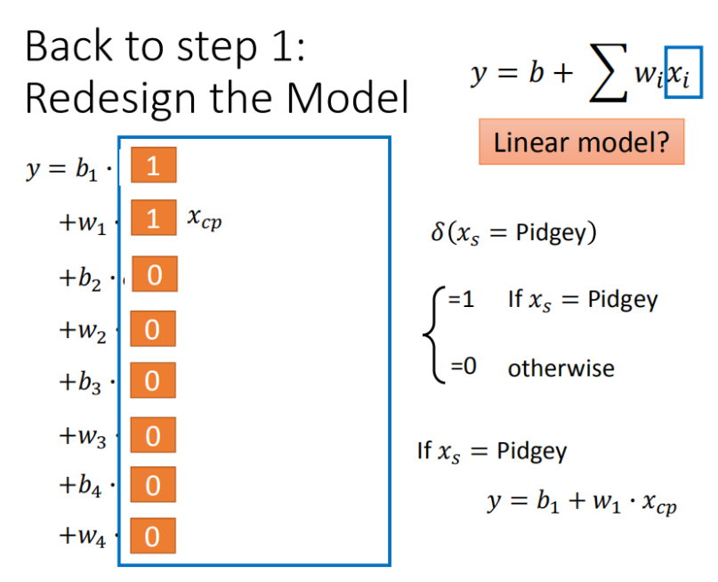

# 回归

#### 回归定义

回归就是找到一个函数，输入特征x,输出一个数值。

#### 回归三部曲

1. 从 A set of function中选择一个function(可能单特征/多特征)

2. 通过Loss function来评判模型的好坏,如: 
   $$
   L(w,b)= \sum_{n=1}^{10}\left ( \hat{y}^n - (b + w·x_{cp}) \right )^2
   $$
   
3. 通过梯度下降方法选择最佳的模型，如：

   * 步骤1：随机选取一个
     $$
     w^0
     $$
     
   * 步骤2：计算微分，也就是当前的斜率，根据斜率来判定移动的方向
   
     - 大于0向右移动（增加w）
     - 小于0向左移动（减少w）
   
   * 步骤3：根据学习率移动
   
   * 重复步骤2和步骤3，直到找到最低点
   
   3.1. 梯度下降也还会有其他的问题
   
   - 问题1：当前最优（Stuck at local minimal）
   - 问题2：等于0（Stuck at saddle point）
   - 问题3：趋近于0（Very slow at the plateau）

如果模型过于复杂，也会出现过拟合问题，对此提出了几种优化方案：

1. 将多种线性模型放到一种线性模型中，使用一种类似于冲击函数的方式 加入delta函数

2. 如果希望模型表现更好，则加入更多的参数

3. 加入正则化 

     

   - w 越小，表示 function 较平滑的，function输出值与输入值相差不大
   - 在很多应用场景中，并不是 w越小模型越平滑越好，但是经验值告诉我们 w 越小大部分情况下都是好的。
   - b的值接近于0，对曲线平滑是没有影响
