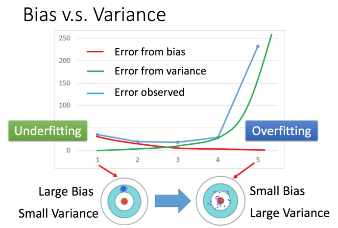
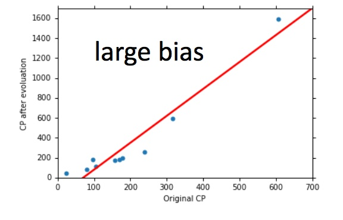
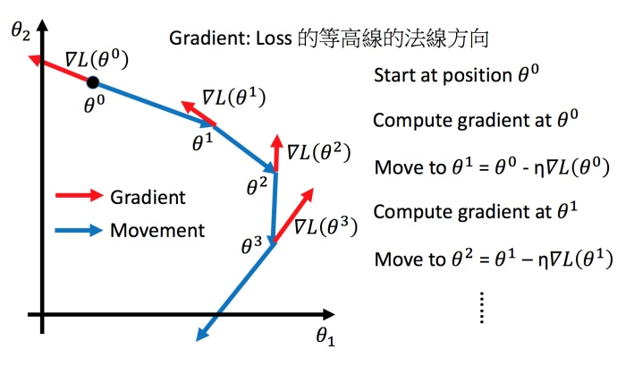

# 误差_梯度下降

这几节课主要讲了机器学习中bias、error、variance和梯度下降相关知识

## 误差从哪里来

​	这节课的核心内容就是判断究竟是欠拟合造成的误差还是过拟合造成的误差：

​	简单模型（左边）是偏差比较大造成的误差，这种情况叫做欠拟合，而复杂模型（右边）是方差过大造成的误差，这种情况叫做过拟合。

### [怎么判断？](https://datawhalechina.github.io/leeml-notes/#/chapter5/chapter5?id=怎么判断？)

#### [分析](https://datawhalechina.github.io/leeml-notes/#/chapter5/chapter5?id=分析)

如果模型没有很好的训练训练集，就是偏差过大，也就是欠拟合 如果模型很好的训练训练集，即再训练集上得到很小的错误，但在测试集上得到大的错误，这意味着模型可能是方差比较大，就是过拟合。 对于欠拟合和过拟合，是用不同的方式来处理的

##### [偏差大-欠拟合](https://datawhalechina.github.io/leeml-notes/#/chapter5/chapter5?id=偏差大-欠拟合)

此时应该重新设计模型。因为之前的函数集里面可能根本没有包含f^*。可以：

​	将更多的函数加进去，比如考虑高度重量，或者HP值等等。 或者考虑更多次幂、更复杂的模型。 如果此时强行再收集更多的data去训练，这是没有什么帮助的，因为设计的函数集本身就不好，再找更多的训练集也不会更好。

##### [方差大-过拟合](https://datawhalechina.github.io/leeml-notes/#/chapter5/chapter5?id=方差大-过拟合)

简单粗暴的方法：更多的数据

但是很多时候不一定能做到收集更多的data。可以针对对问题的理解对数据集做调整。比如识别手写数字的时候，偏转角度的数据集不够，那就将正常的数据集左转15度，右转15度，类似这样的处理。

## 交叉验证

​	交叉验证就是将训练集再分为两部分，一部分作为训练集，一部分作为验证集。用训练集训练模型，然后再验证集上比较，确实出最好的模型之后（比如模型3），再用全部的训练集训练模型3，然后再用public的测试集进行测试，此时一般得到的错误都是大一些的。

## N-折交叉验证

将训练集分成N份，比如分成3份。

比如在三份中训练结果Average错误是模型1最好，再用全部训练集训练模型1。

## 梯度下降法

回归问题的第三步中，需要解决下面的最优化问题：
$$
\theta^∗= \underset{ \theta }{\operatorname{arg\ min}} L(\theta) \tag1
$$

- L:lossfunction（损失函数）
- θ:parameters（参数）

这里的parameters是复数，即 \thetaθ 指代一堆参数，比如上篇说到的 ww 和 bb 。

我们要找一组参数 \thetaθ ，让损失函数越小越好，这个问题可以用梯度下降法解决：

假设θ 有里面有两个参数θ1,θ2 随机选取初始值
$$
\theta^0 = \begin{bmatrix} \theta_1^0 \\ \theta_2^0 \end{bmatrix} \tag2
$$
这里可能某个平台不支持矩阵输入，看下图就好。

然后分别计算初始点处，两个参数对 L的偏微分，然后 0 减掉 η 乘上偏微分的值，得到一组新的参数。同理反复进行这样的计算。黄色部分为简洁的写法，▽L(θ) 即为梯度。

η 叫做Learning rates（学习速率）

上图举例将梯度下降法的计算过程进行可视化。

### 调整学习速率

#### 自适应学习率：

##### [Adagrad 算法](https://datawhalechina.github.io/leeml-notes/#/chapter6/chapter6?id=adagrad-算法)

Adagrad：
$$
w^{t+1} \leftarrow w^t -\frac{η^t}{\sigma^t}g^t \tag5
$$

$$
g^t =\frac{\partial L(\theta^t)}{\partial w} \tag6
$$

- σt :之前参数的所有微分的均方根，对于每个参数都是不一样的。例如：化简式子之后为：

  

### [随机梯度下降法](https://datawhalechina.github.io/leeml-notes/#/chapter6/chapter6?id=tip2：随机梯度下降法)

之前的梯度下降：
$$
L=\sum_n(\hat y^n-(b+\sum w_ix_i^n))^2 \tag8
$$

$$
\theta^i =\theta^{i-1}- \eta\triangledown L(\theta^{i-1}) \tag9
$$

而随机梯度下降法更快：

损失函数不需要处理训练集所有的数据，选取一个例子 x^nxn
$$
L=(\hat y^n-(b+\sum w_ix_i^n))^2 \tag{10}
$$

$$
\theta^i =\theta^{i-1}- \eta\triangledown L^n(\theta^{i-1}) \tag{11}
$$

此时不需要像之前那样对所有的数据进行处理，只需要计算某一个例子的损失函数Ln，就可以赶紧update 梯度。

对比：常规梯度下降法走一步要处理到所有二十个例子，但随机算法此时已经走了二十步（每处理一个例子就更新)

### [特征缩放](https://datawhalechina.github.io/leeml-notes/#/chapter6/chapter6?id=tip3：特征缩放)

怎么做缩放：上图每一列都是一个例子，里面都有一组特征。

对每一个维度 i（绿色框）都计算平均数，记做 mi；还要计算标准差，记做σi。

然后用第 r 个例子中的第 i个输入，减掉平均数mi，然后除以标准差σi，得到的结果是所有的维数都是0，所有的方差都是1

### 梯度下降的理论基础

泰勒相关：[P6 梯度下降 (datawhalechina.github.io)](https://datawhalechina.github.io/leeml-notes/#/chapter6/chapter6)

梯度下降时只考虑了泰勒展开式的一次项、如果考虑二次项(比如牛顿法)在实际中不是特别好，会涉及到二次微分等，多很多的运算，性价比不好。