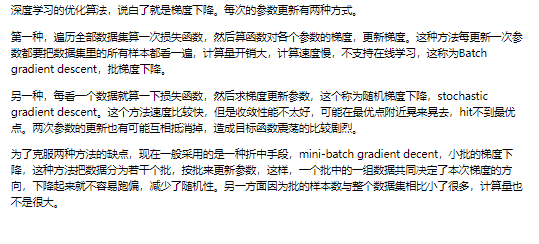
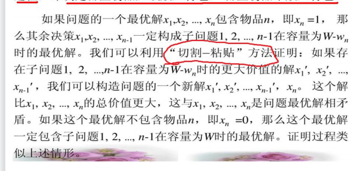

##  NP 问题是什么，画出 p，np，npc 的关系:

### P Problem

如果一个问题可以找到一个能在多项式的时间里解决它的算法，那么这个问题就属于P问题，即算法的时间复杂度是多项式级的。比如n个数中间找到最大值，或者n个数排序之类的。

### NP Problem

NP问题的另一个定义是可以在多项式的时间里猜到一个解的问题，例如求问图中起点到终点是否有一条小于100个单位长度的路线，随便选一条，如果算出来路径小于100，那么就猜到了一个解，也就是说如果你运气足够好的话就可以在多项式时间内解决这个问题。当然猜的前提是问题存在解。

再比如Hamilton问题，给定一幅图，是否能找到一条经过每个顶点一次且恰好一次最后又走回来的路，每条路都可以在多项式时间内判断这条路是否恰好经过了每个顶点，所以也是NP问题。

很显然，所有的P类问题都是NP问题，能在多项式时间内解决，必然能多项式地验证一个解。（NP是否等于P这个问题貌似还没有定论？）

### NPC Problem

#### 约化

为了说明NPC问题，我们先引入一个概念——约化(Reducibility，有的资料上叫“归约”（Reduction）) 。

**约化的概念**： 
约化的标准概念：如果能找到这样一个变化法则，对任意一个程序A的输入，都能按这个法则变换成程序B的输入，使两程序的输出相同，那么我们说，问题A可约化为问题B，即可以用问题B的解法解决问题A，或者说，问题A可以“变成”问题B。 如：一元一次方程可以“归约”为一元二次方程。

**约化的性质：** 
约化具有一项重要的性质：约化具有传递性。如果问题A可约化为问题B，问题B可约化为问题C，则问题A一定可约化为问题C。

**约化的意义：** 
问题A可约化为问题B”有一个重要的直观意义：B的时间复杂度高于或者等于A的时间复杂度。也就是说，问题A不比问题B难。

**约化的要求：** 
我们所说的“可约化”指的是可“多项式时间地”约化(Polynomial-time Reducible)，即变换输入的方法是能在多项式的时间里完成的。约化的过程只有用多项式的时间完成才有意义。

#### NPC问题

**NPC问题是指满足下面两个条件的问题：** 
**（1）它是一个NP问题；** 
**（2）所有的NP问题都可以用多项式时间约化到它。**

所以显然NP完全问题具有如下性质：它可以在多项式时间内求解，当且仅当所有的其他的NP完全问题也可以在多项式时间内求解。这样一来,只要我们找到一个NPC问题的多项式解，所有的NP问题都可以多项式时间内约化成这个NPC问题，再用多项式时间解决，这样NP就等于P了。

目前，NPC问题还没有找到一个多项式时间算法，因此我们就此可直观地理解，NPC问题目前没有多项式时间复杂度的有效算法，只能用指数级甚至阶乘级复杂度的搜索。

大多数人的观点对于 P类问题，NP类问题，NPC之间的关系可用下图表示（此图正确性有待验证）：

  	  **P: 能在多项式时间内解决的问题**

　　**NP: 不能在多项式时间内解决或不确定能不能在多项式时间内解决，但能在多项式时间验证的问题**

　　**NPC: NP完全问题，所有NP问题在多项式时间内都能约化(Reducibility)到它的NP问题，即解决了此NPC问题，所有NP问题也都得到解决。**

　　**NP hard:NP难问题，所有NP问题在多项式时间内都能约化(Reducibility)到它的问题(不一定是NP问题)。**

## 算法的概念，什么是好的算法？算法的复杂度怎么计算？

## 什么是分治法，说说你的研究中哪里用到了分治法？

## 蛮力和回溯

## 分支界限法

## 动态规划算法

## 贪心算法

## 随机算法与近似算法

## 什么是旅行商问题？在回溯法，分支限界法，贪心算法，动态规划算法其中任选两种，求解旅行商问题,写出求解思路,伪代码

https://www.cnblogs.com/dddyyy/p/10084673.html

https://blog.csdn.net/sgsx11/article/details/121482958