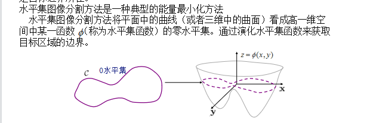
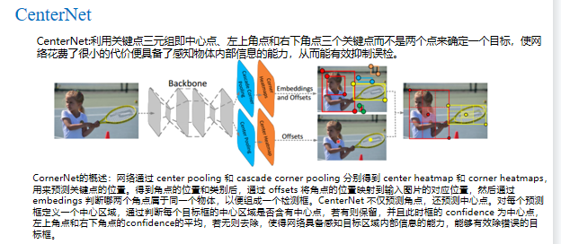
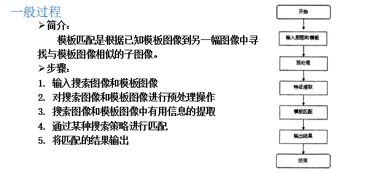
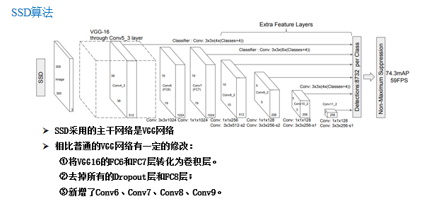
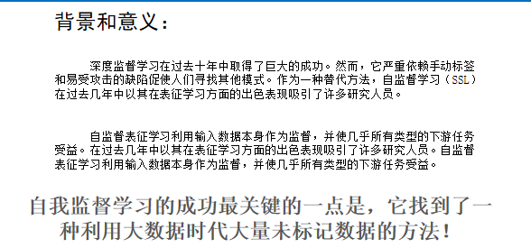

# 计算机视觉      

计算机视觉是一门关于如何运用照相机和计算机来获取我们所需的，被拍摄对象的数据与信息的学问。

图像处理是用任何信号处理等数学操作处理图像的过程，输入时图像（摄影图像或者视频帧），输出是图像或者与输入图像有关的特征、参数的集合。

计算机图形学是计算机科学的一个子领域，它包括数字合成和操作可视内容（图像、视频）的方法。尽管这个术语通常指三维计算机图形学的研究，但它也包括二维图形学和图像处理。

## 数字图像处理

**数字图像处理是对输入图像进行有目的地转化，从而提高图像质量、视觉效果等，研究的是图像的获取、传输、存储、变换、显示、理解和综合利用的学科。**

### 灰度图像处理

#### 灰度线性变换

**灰度线性变换是灰度变换的一种，图像的灰度变换通过建立灰度映射来调整原图像的灰度，从而达到图像增强的目的。灰度映射通常是用灰度变换曲线来表示的**

#### 傅里叶变换

任何一种时域信号或空域信号

都可以转换为频域信号

有时候在频域上处理信号更加简单

### 图像去噪

噪声的产生是信号在采集、传输以及记录过程中，受到成像设备自身因素和外界环境的影响而产生的。通过去噪可以有效地增大图像信号的信噪比，提高图像质量 ，更好地体现原始图像所携带的信息

#### 基于滤波器的方法

利用某些人工设计的低通滤波器来去除图像噪声。包括均值滤波、中值滤波、高斯滤波

#### **基于模型的方法**

试图对自然图像或噪声的分布进行建模，然后使用模型分布作为先验，试图获得清晰的图像与优化算法。

​	基于模型的方法通常将去噪任务定义为基于最大后验(MAP)的优化问题，其性能主要依赖于图像的先验。包括**非局部自相似（NSS）模型，稀疏模型，梯度模型和马尔可夫随机场（MRF）模型**。

#### **基于学习的方法**

学习有噪声图像到干净图像的潜在映射，可以分为传统的基于学习的方法和基于深度网络的学习方法。

### 边缘检测

**边缘的定义**

**图像中灰度发生突变或不连续的微小区域，即是两个具有相对不同灰度值特性的区域的边界线。**

在一幅图像中，边缘有**方向**和幅度两个特性。

**一般认为沿边缘走向的灰度变化较为平缓，而垂直于边缘走向的灰度变化剧烈。**灰度梯度指向边缘的垂直方向。

**基于曲面拟合的边缘检测方法**

**基于差分检测图像边缘的算子往往对噪声敏感。因此对一些噪声比较严重的图像就难以取得满意的效果。**

**若用平面或高阶曲面拟合图像中某一小区域的灰度表面，求这个拟合平面或曲面的外法线方向的微分或二阶微分检测边缘，可减少噪声影响。**

### 特殊形状检测

#### 点检测

**用空域的高通滤波器来检测孤立点**

#### 线检测

霍夫变换

### 图像形态学操作

#### 腐蚀

**腐蚀是一种消除边界点，使边界向内部收缩的过程。可以用来消除小且无意义的物体。**

#### 膨胀

**膨胀在数学形态运算中的作用是扩展物体的边界点，在数字图像处理中，对于确定的结构元素，通过膨胀运算可以使一些相临距离较短的区域进行连接；**

#### 开运算

**开运算可以看作对目标图像先做腐蚀处理再用膨胀处理进行恢复**

#### 闭运算

**闭运算可以看作是先做膨胀处理再用腐蚀处理的方法进行恢复**

## 图像分割

### 概念

图像分割是指根据灰度、彩色、空间纹理、几何形状等特征把图像划分成若干个互不相交的区域，使得这些特征在同一区域内表现出一致性或相似性，而在不同区域间表现出明显的不同。

**目标分割**将不同分属不同物体的像素区域分开。 如前景与后景分割开，狗的区域与猫的区域与背景分割开。
**语义分割**在普通分割的基础上，分类出每一块区域的语义（即这块区域是什么物体）。 如把画面中的所有物体都指出它们各自的类别。
**实例分割**在语义分割的基础上，给每个物体编号。 如这个是该画面中的狗A，那个是画面中的狗B。

### 图像分割方法

#### 根据阈值的分割方法

​	图像阈值分割是一种广泛应用的分割技术，利用图像中要提取的目标物与其背景在灰度特性上的差异，把图像视为具有不同灰度级的两类区域 (目标和背景)的组合，选取一个合适的阈值，以确定图像中每个象素点应该属于目标还是背景区域，从而产生相应的二值图像。

阈值处理概述
图像二值化 
直方图阈值分割
最佳阈值分割

自适应阈值分割

​	阈值分割法的特点是：
适用于物体与背景有较强对比的情况，背景或物体的灰度比较单一；
而且总可以得到封闭且连通区域的边界。

#### 基于区域的分割方法

#### 基于边缘的分割方法

#### 基于聚类的分割方法

聚类方法包括：
K-means
模糊聚类
谱聚类
。。。

#### 基于优化算法的分割方法

##### 水平集方法

##### 图割方法

## 目标检测

### 概念

目标检测（Object Detection）的任务是找出图像中所有感兴趣的目标（物体），确定它们的类别和位置，是计算机视觉领域的核心问题之一

目标识别（Object Recognition ）的任务是基于分类（Classification）的识别（Recognition）问题，即是在所有的给定数据中，分类出哪一些sample是目标，哪一些不是。

### 目标检测分类

### 基于特征点的目标检测

#### SIFT算法

将一幅图像映射（变换）为一个局部特征向量集；特征向量具有平移、缩放、旋转不变性，同时对光照变化、放射及投影变换也有一定不变性。

#### ORB算法

ORB算法(Oriented FAST and Rotated BRIEF)：一种快速特征点提取和描述的算法,将FAST特征点的检测方法与BRIEF特征描述子结合起来，并在它们原来的基础上做了改进与优化

#### HOG算法

### 基于模板匹配的目标检测

#### 基于灰度的模板匹配算法

##### MAD

##### SSDA

##### SATD

### 基于深度学习的目标检测

#### One-Stage目标检测算法

##### YOLO

##### SSD

#### Two-Stage目标检测算法

##### RCNN

### 人脸识别

### 图像行人再识别

## 图像增强

有目的地强调图像的整体或局部特性，将原来不清晰的图像变得清晰或强调某些感兴趣的特征，扩大图像中不同物体特征之间的差别，抑制不感兴趣的特征，使之改善图像质量、丰富信息量，加强图像判读和识别效果，满足某些特殊分析的需要

### 图像去雨算法

#### 基于模型驱动算法

   利用图像的先验知识，如雨条纹的方向、密度和尺寸等约束去雨问题及去雨模型，再通过设计优化算法进行求解，从而获得干净无雨的图像。

#### 基于数据驱动算法

  以深度学习为代表，通过构建神经网络，利用成对的雨条纹标签和干净无雨图像来学习有雨到无雨的非线性映射

### 图像去雾

#### 基于图像增强的去雾算法

 通过图像增强技术突出图像细节，提升对比度。具体算法有：直方图均衡化算法、Retinex算法、小波变换算法、偏微分方程算法等；

#### 基于图像复原的去雾算法

   基于大气散射物理学模型，根据有雾图像的形成过程来进行逆运算，从而恢复清晰图像

#### 基于深度学习的去雾算法

  ①基于大气散射模型，使用神经网络生成大气散射模型中的某些参数，从而复原出清晰无雾的图像；②直接端到端的生成清晰的无雾图像。

### 图像超分辨率

#### 基于插值的图像重建方法

​       根据 LR 图像已知的像素点灰度信息，运用插值公式增强像素点间的灰度信息来实现图像放大问题。

#### 基于重构的图像重建方法

#### 基于学习的重建方法

基于 CNN 网络模型的超分方法   

基于生成对抗网络GAN网络模型的超分方法

## 视频目标跟踪

## 图像合成与生成

​		图像合成 (image composition) 是图像处理的常用操作，把前景从一张图上剪贴下来粘贴到另一张图上，获得一张合成图。合成图可以用来获取感兴趣的目标图像，也可以用于数据增广，有着广泛的应用的前景。

​		图像生成 (image generation) 是指根据给定的信息，生成特定的图像。这里的信息可以使噪声、图像、文字、音频等各种类型的信息。

### 图像拼接

#### 特征点检测

#### 图像配准

#### 单应矩阵

#### 图像变形和融合

### 图像合成

### 图像生成

## 前沿

### 小样本学习

判别模型、生成模型

### 自监督学习

### 图像描述

