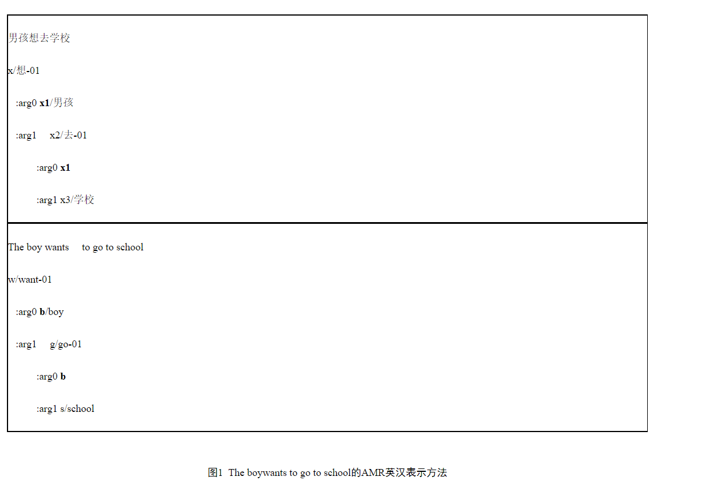

# AMR-IE

if use_graph_encoder:

​	FinalGNN 输入参数：bert_dim:2048、edge_type_dim:256、event_type_num:34+entity_type_num:8（edge_types）、edge_type_num:13、gnn_layers:2、lamda:0.002


graphsage : 

```
{"epoch": 98, "time(m)": 30.0, "loss": 1.6293018967242408, "dev": {"entity": {"prec": 0.8983444670345628, "rec": 0.9035933391761612, "f": 0.9009612583745994}, "mention": {"prec": 0.014231774615161197, "rec": 0.014314928425357873, "f": 0.014273230410719488}, "trigger": {"prec": 0.7719714964370546, "rec": 0.6944444444444444, "f": 0.7311586051743533}, "trigger_id": {"prec": 0.8147268408551069, "rec": 0.7329059829059829, "f": 0.7716535433070867}, "role": {"prec": 0.31983805668016196, "rec": 0.1083676268861454, "f": 0.16188524590163933}, "role_id": {"prec": 0.4817813765182186, "rec": 0.16323731138545952, "f": 0.24385245901639344}, "relation": {"prec": 0.12614347616754934, "rec": 0.3598901098901099, "f": 0.1868092691622103}}, "test": {"entity": {"prec": 0.8983444670345628, "rec": 0.9035933391761612, "f": 0.9009612583745994}, "mention": {"prec": 0.014231774615161197, "rec": 0.014314928425357873, "f": 0.014273230410719488}, "trigger": {"prec": 0.7719714964370546, "rec": 0.6944444444444444, "f": 0.7311586051743533}, "trigger_id": {"prec": 0.8147268408551069, "rec": 0.7329059829059829, "f": 0.7716535433070867}, "role": {"prec": 0.31983805668016196, "rec": 0.1083676268861454, "f": 0.16188524590163933}, "role_id": {"prec": 0.4817813765182186, "rec": 0.16323731138545952, "f": 0.24385245901639344}, "relation": {"prec": 0.12614347616754934, "rec": 0.3598901098901099, "f": 0.1868092691622103}}}


{"epoch": 99, "time(m)": 30.0, "loss": 1.7950015796442815, "dev": {"entity": {"prec": 0.8986054619407321, "rec": 0.9035933391761612, "f": 0.9010924981791696}, "mention": {"prec": 0.014235909355026147, "rec": 0.014314928425357873, "f": 0.014275309541150765}, "trigger": {"prec": 0.7677725118483413, "rec": 0.6923076923076923, "f": 0.7280898876404496}, "trigger_id": {"prec": 0.8127962085308057, "rec": 0.7329059829059829, "f": 0.7707865168539325}, "role": {"prec": 0.3215686274509804, "rec": 0.11248285322359397, "f": 0.16666666666666669}, "role_id": {"prec": 0.49019607843137253, "rec": 0.17146776406035666, "f": 0.2540650406504065}, "relation": {"prec": 0.12958551691281564, "rec": 0.37362637362637363, "f": 0.1924301379554298}}, "test": {"entity": {"prec": 0.8986054619407321, "rec": 0.9035933391761612, "f": 0.9010924981791696}, "mention": {"prec": 0.014235909355026147, "rec": 0.014314928425357873, "f": 0.014275309541150765}, "trigger": {"prec": 0.7677725118483413, "rec": 0.6923076923076923, "f": 0.7280898876404496}, "trigger_id": {"prec": 0.8127962085308057, "rec": 0.7329059829059829, "f": 0.7707865168539325}, "role": {"prec": 0.3215686274509804, "rec": 0.11248285322359397, "f": 0.16666666666666669}, "role_id": {"prec": 0.49019607843137253, "rec": 0.17146776406035666, "f": 0.2540650406504065}, "relation": {"prec": 0.12958551691281564, "rec": 0.37362637362637363, "f": 0.1924301379554298}}}
```

GAT:

```
{"epoch": 46, "time(m)": 33.0, "loss": 1.194603465907701, "dev": {"entity": {"prec": 0.9024246008279124, "rec": 0.8916155419222904, "f": 0.8969875091844233}, "mention": {"prec": 0.0, "rec": 0.0, "f": 0}, "trigger": {"prec": 0.7677725118483413, "rec": 0.6923076923076923, "f": 0.7280898876404496}, "trigger_id": {"prec": 0.8080568720379147, "rec": 0.7286324786324786, "f": 0.7662921348314606}, "role": {"prec": 0.5744985673352435, "rec": 0.5500685871056241, "f": 0.5620182200420463}, "role_id": {"prec": 0.6389684813753582, "rec": 0.6117969821673526, "f": 0.6250875963559916}, "relation": {"prec": 0.47014115092290987, "rec": 0.5947802197802198, "f": 0.5251667677380231}}, "test": {"entity": {"prec": 0.9024246008279124, "rec": 0.8916155419222904, "f": 0.8969875091844233}, "mention": {"prec": 0.0, "rec": 0.0, "f": 0}, "trigger": {"prec": 0.7677725118483413, "rec": 0.6923076923076923, "f": 0.7280898876404496}, "trigger_id": {"prec": 0.8080568720379147, "rec": 0.7286324786324786, "f": 0.7662921348314606}, "role": {"prec": 0.5744985673352435, "rec": 0.5500685871056241, "f": 0.5620182200420463}, "role_id": {"prec": 0.6389684813753582, "rec": 0.6117969821673526, "f": 0.6250875963559916}, "relation": {"prec": 0.47014115092290987, "rec": 0.5947802197802198, "f": 0.5251667677380231}}}


{"epoch": 47, "time(m)": 33.0, "loss": 1.207388882479447, "dev": {"entity": {"prec": 0.8994134897360704, "rec": 0.8959976628688285, "f": 0.8977023269427776}, "mention": {"prec": 0.0, "rec": 0.0, "f": 0}, "trigger": {"prec": 0.771889400921659, "rec": 0.7158119658119658, "f": 0.7427937915742794}, "trigger_id": {"prec": 0.815668202764977, "rec": 0.7564102564102564, "f": 0.7849223946784922}, "role": {"prec": 0.5876288659793815, "rec": 0.5473251028806584, "f": 0.5667613636363636}, "role_id": {"prec": 0.6406480117820325, "rec": 0.5967078189300411, "f": 0.6178977272727273}, "relation": {"prec": 0.4866666666666667, "rec": 0.6016483516483516, "f": 0.538083538083538}}, "test": {"entity": {"prec": 0.8994134897360704, "rec": 0.8959976628688285, "f": 0.8977023269427776}, "mention": {"prec": 0.0, "rec": 0.0, "f": 0}, "trigger": {"prec": 0.771889400921659, "rec": 0.7158119658119658, "f": 0.7427937915742794}, "trigger_id": {"prec": 0.815668202764977, "rec": 0.7564102564102564, "f": 0.7849223946784922}, "role": {"prec": 0.5876288659793815, "rec": 0.5473251028806584, "f": 0.5667613636363636}, "role_id": {"prec": 0.6406480117820325, "rec": 0.5967078189300411, "f": 0.6178977272727273}, "relation": {"prec": 0.4866666666666667, "rec": 0.6016483516483516, "f": 0.538083538083538}}}
```


AMR（Abstract MeaningRepresentation，抽象语义表示）是句子语义的一种表示方法，将一个句子的语义抽象为一个单根有向无环图。在这个语义图上，句子中的实词抽象为概念节点，实词之间的关系抽象为带有语义关系标签的有向弧，同时忽略虚词和形态变化体现的较虚的语义（如the、单复数、时、体等等）。图1分别给出了“The boywants to go to school”及中文翻译“男孩想去学校”的AMR表示。



图1中，每个概念节点都有一个字母开头的编号。“想（want）”作为句子唯一的根结点，编号分别是x和w，“男孩（boy）”作为“想（want）”的**arg0（施事）**，“去（go）”作为“想（want）”的**arg1（受事）**。这里与传统的句法分析或语义角色标注有一些差异，英文做了词形还原，省略了冠词the、形态标记（动词的数、介词to），而汉语则没有词形方面的变化。与传统表示方法的主要不同在于对论元共享现象的处理，例如“想（want）”和“去（go）”的arg0都是“男孩（boy）”。传统的句法分析方法受限于树结构，往往舍弃“男孩-去”这个关系；而语义角色标注会保留两个关系，形成图结构。AMR为了保留论元共享的信息，又避免图结构的凌乱显示，允许重复使用词语的编号b和x1，使得AMR在保持树状层次结构的同时，保有图结构的信息。
